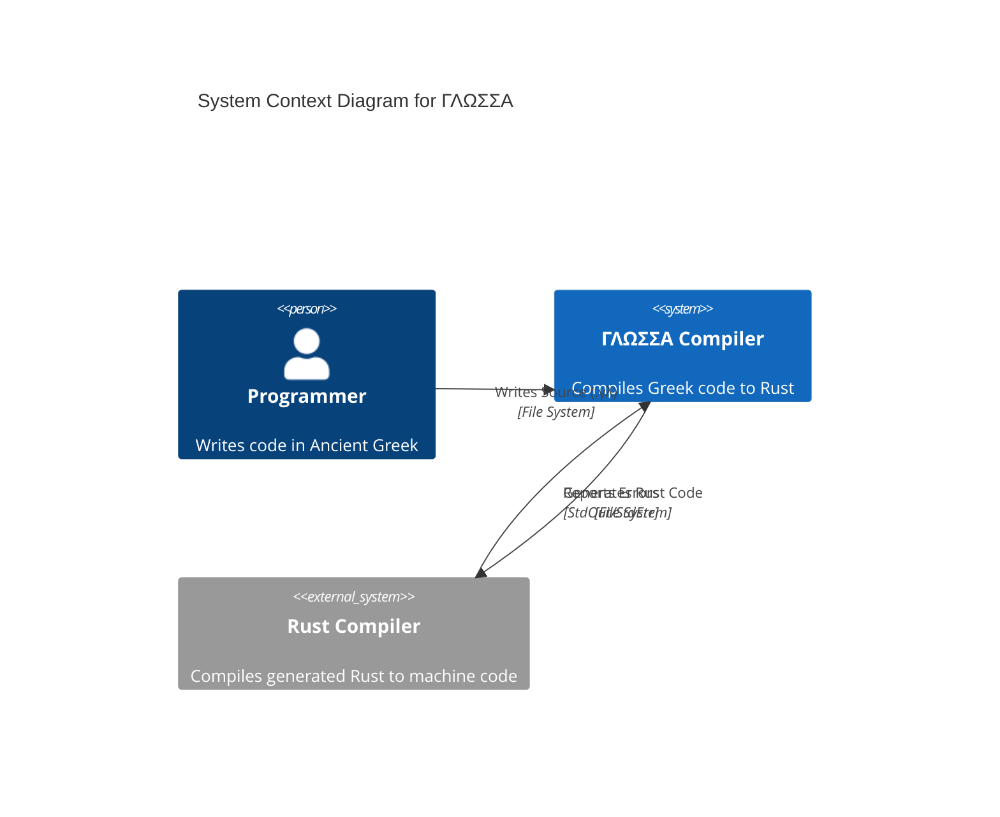
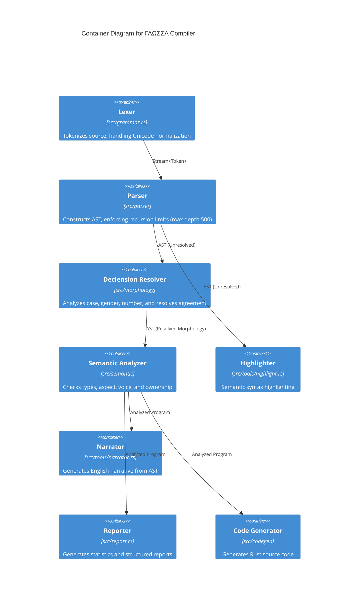
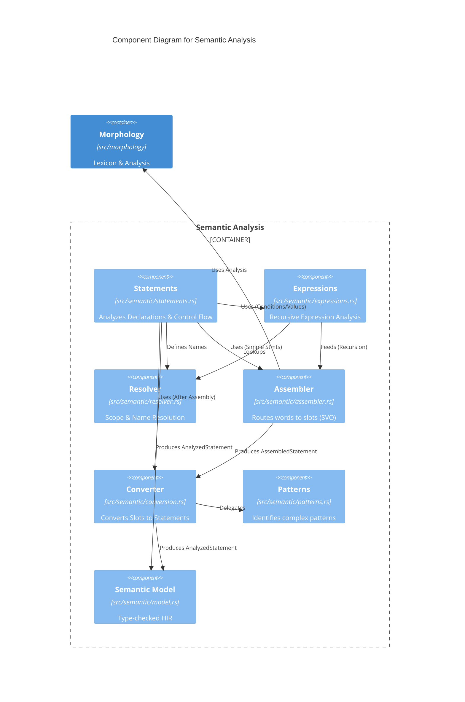

# Architecture

This document describes the high-level architecture of the ΓΛΩΣΣΑ (GLOSSA) programming language compiler.

## System Context (C4 Level 1)

The following diagram illustrates how ΓΛΩΣΣΑ fits into the development environment.

## Compiler Pipeline (C4 Container Level)

The compiler is organized as a pipeline of modules, transforming source text into Rust code.

## Semantic Analysis (C4 Component Level)

The semantic analysis phase is unique due to the slot-based assembler which enables free word order.

