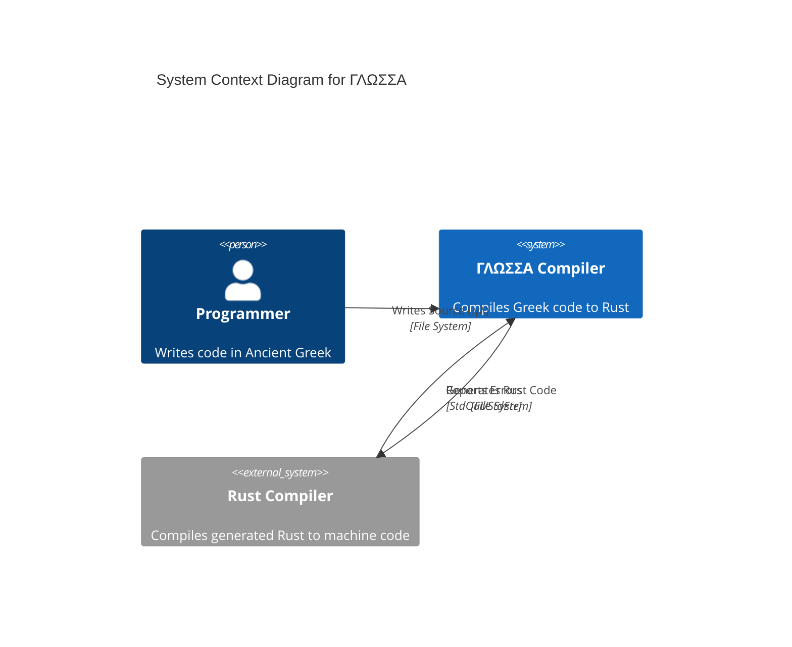
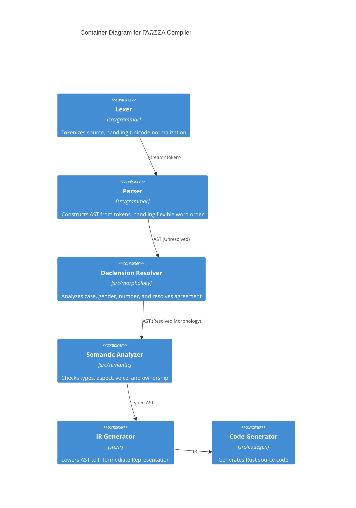
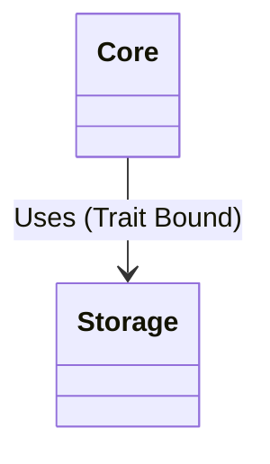

# Architecture

This document describes the high-level architecture of the ΓΛΩΣΣΑ (GLOSSA) programming language compiler.

## System Context (C4 Level 1)

The following diagram illustrates how ΓΛΩΣΣΑ fits into the development environment.

## Compiler Pipeline (C4 Container Level)

The compiler is organized as a pipeline of modules, transforming source text into Rust code.

## Core-Storage Decoupling (Class Level)

The following diagram illustrates the decoupled relationship between Core and Storage.

