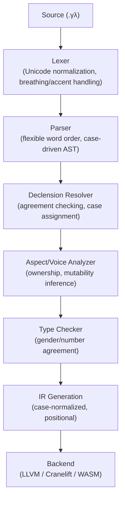

# ΓΛΩΣΣΑ (GLŌSSA)

## A Programming Language with Greek Declensions

*"πάντα ῥεῖ καὶ οὐδὲν μένει"* — All flows and nothing stays (Heraclitus)
*Except your data, if you persist it correctly.*

---

## 1. Philosophy & Vision

### 1.1 Core Thesis

Modern programming languages encode semantic relationships through **position** (argument order), **punctuation** (dots, parentheses, brackets), and **keywords**. ΓΛΩΣΣΑ instead encodes these relationships through **morphological inflection**—the same mechanism Ancient Greek used to express complex philosophical and mathematical ideas with unparalleled precision.

Greek offers capabilities Latin cannot match:

- **The Middle Voice**: Actions performed on oneself—perfect for methods that mutate `self`
- **The Aorist Aspect**: Completed, one-shot actions—ideal for destructive moves and transactions
- **The Optative Mood**: Wishes and possibilities—nullable types and optional chaining
- **The Dual Number**: Exactly two of something—tuple pairs, bilateral operations
- **Rich Participles**: Verbal adjectives—inline lambdas and closures

This is not merely an aesthetic exercise. Declension-based syntax offers:

- **Flexible word order**: The compiler understands intent regardless of token sequence
- **Self-documenting relationships**: The role of every identifier is visible in its suffix
- **Reduced punctuation noise**: No more `object.method(arg1, arg2).chain()`
- **Aspect-driven semantics**: Whether an action is ongoing, completed, or instantaneous is grammatically encoded

### 1.2 Design Principles

1. **Inflection over position**: Grammatical suffixes carry semantic weight
2. **Aspect over tense**: Aorist (point action), Present (ongoing), Perfect (completed with result)
3. **Voice over syntax**: Active/Middle/Passive determine subject-object relationships
4. **Mood over keywords**: Indicative (definite), Subjunctive (conditional), Optative (optional), Imperative (command)
5. **Agreement over annotation**: Types flow through grammatical agreement
6. **Poetry over punctuation**: Minimal symbolic noise

### 1.3 Inspirations

- Ancient Greek's five-case system, three voices, and four moods
- The precision of Greek philosophical and mathematical texts
- APL's terseness and symbolic density
- Rust's ownership semantics (mapped to voice and aspect)
- Haskell's type system (mapped to grammatical agreement)

---

## 2. The Case System

### 2.1 The Five Cases

ΓΛΩΣΣΑ uses the classical Greek five-case system. Each case has a distinct programming semantic:

| Case | Greek Name | Suffix Pattern | Programming Role |
|------|------------|----------------|------------------|
| **Nominative** | ὀνομαστική | `-ος/-η/-ον` | Subject: the actor, the assignee, the returned value |
| **Genitive** | γενική | `-ου/-ης/-ου` | Possession: property access, scoping, type-of relationships |
| **Dative** | δοτική | `-ῳ/-ῃ/-ῳ` | Indirect object: recipient, destination, listener, callback target |
| **Accusative** | αἰτιατική | `-ον/-ην/-ον` | Direct object: the argument being acted upon |
| **Vocative** | κλητική | `-ε/-η/-ον` | Address: error messages, debug output, REPL interaction |

### 2.2 Declension Paradigms

ΓΛΩΣΣΑ supports three declension patterns, mapped to type categories:

**First Declension (-η/-α stem)**: Collection types, feminine abstracts
```
λιστη (listē) - list
    Nom: λιστη        "the list [does something]"
    Gen: λιστης       "of the list / list's [property]"
    Dat: λιστῃ        "to/for the list"
    Acc: λιστην       "the list [as object]"
    Voc: λιστη        "O list!"
```

**Second Declension (-ος stem)**: Concrete objects, agents, masculine
```
χρηστος (chrēstos) - user
    Nom: χρηστος      "the user [does something]"
    Gen: χρηστου      "of the user / user's [property]"
    Dat: χρηστῳ       "to/for the user"
    Acc: χρηστον      "the user [as object]"
    Voc: χρηστε       "O user!"
```

**Third Declension (consonant stem)**: Primitives, irregular types
```
ὀνομα (onoma) - name/string
    Nom: ὀνομα        "the name [does something]"
    Gen: ὀνοματος     "of the name"
    Dat: ὀνοματι      "to/for the name"
    Acc: ὀνομα        "the name [as object]"
    Voc: ὀνομα        "O name!"
```

### 2.3 Case Usage Examples

```glossa
// Traditional: result = user.name
ἀποτελεσμος χρηστου ὀνομα.
(apotelesmatos chrēstou onoma)
"result [is] of-the-user name"

// Traditional: list.push(item)
λιστῃ στοιχειον ὠθει.
(listēi stoicheion ōthei)
"to-the-list item pushes"

// Traditional: database.save(user, callback)
δαταβασις χρηστον σωζει, λογγῳ.
(databasis chrēston sōzei, loggōi)
"database user saves, for-the-logger"
```

---

## 3. The Verb System

### 3.1 Aspect (The Heart of ΓΛΩΣΣΑ)

Greek aspect is more fundamental than tense. ΓΛΩΣΣΑ uses aspect to encode **operation semantics**:

| Aspect | Greek Term | Semantic | Programming Meaning |
|--------|------------|----------|---------------------|
| **Present** | ἐνεστώς | Ongoing, repeated | Iteration, streaming, continuous operation |
| **Aorist** | ἀόριστος | Point action, complete | One-shot execution, move semantics, transaction |
| **Perfect** | παρακείμενος | Completed with lasting result | Cached/memoized, immutable result, persistent state |
| **Imperfect** | παρατατικός | Ongoing in past | Replay, historical query, event sourcing |
| **Future** | μέλλων | Will happen | Lazy evaluation, promises, deferred execution |
| **Pluperfect** | ὑπερσυντέλικος | Past completed before past | Snapshot, point-in-time recovery |

### 3.2 Voice

| Voice | Greek | Programming Semantic |
|-------|-------|---------------------|
| **Active** | ἐνεργητική | Subject acts on object: `user.save(data)` |
| **Middle** | μέση | Subject acts on itself: `user.update_self()`, `self` mutation |
| **Passive** | παθητική | Subject receives action: event handlers, reactive bindings |

### 3.3 Mood

| Mood | Greek | Programming Semantic |
|------|-------|---------------------|
| **Indicative** | ὁριστική | Definite execution: this WILL happen |
| **Subjunctive** | ὑποτακτική | Conditional: if/when clauses, guards |
| **Optative** | εὐκτική | Optional: nullable handling, Maybe/Option types |
| **Imperative** | προστακτική | Command: REPL commands, build scripts, side effects |

### 3.4 Verb Conjugation Table: γραφω (graphō) - "to write"

```
PRESENT ACTIVE INDICATIVE (ongoing write operation, streaming)
γραφω       I write (continuously)
γραφεις     you write
γραφει      it writes
γραφομεν    we write
γραφετε     you (pl) write
γραφουσι    they write

AORIST ACTIVE INDICATIVE (one-shot write, move semantics)
ἐγραψα      I wrote (once, completely)
ἐγραψας     you wrote
ἐγραψε      it wrote
ἐγραψαμεν   we wrote
ἐγραψατε    you (pl) wrote
ἐγραψαν     they wrote

PRESENT MIDDLE INDICATIVE (writes itself, self-serialization)
γραφομαι    I write myself
γραφῃ       you write yourself
γραφεται    it writes itself

AORIST PASSIVE INDICATIVE (was written, event received)
ἐγραφην     I was written
ἐγραφης     you were written
ἐγραφη      it was written

PRESENT ACTIVE OPTATIVE (might write, optional/nullable)
γραφοιμι    I might write
γραφοις     you might write
γραφοι      it might write

AORIST ACTIVE SUBJUNCTIVE (if/when written, conditional)
γραψω       if I write
γραψῃς      if you write
γραψῃ       if it writes
```

### 3.5 Verb Examples in Context

```glossa
// Traditional: file.write(data)  -- streaming write
φακελος δεδομενον γραφει.
"file data writes-[ongoing]"

// Traditional: file.write(data)  -- one-shot, file consumed after
φακελος δεδομενον ἐγραψε.
"file data wrote-[aorist]"

// Traditional: user.serialize()  -- self-serialization
χρηστος γραφεται.
"user writes-itself-[middle]"

// Traditional: if let Some(x) = maybe_write(data)
δεδομενον γραψοι.
"data might-write-[optative]"

// Traditional: when file.on_written(callback)
φακελος ἐγραφη, τοτε λογγῳ.
"file was-written-[passive], then to-logger"
```

---

## 4. Number: Singular, Dual, Plural

Greek has a **dual** number for exactly two items. ΓΛΩΣΣΑ exploits this:

| Number | Use Case |
|--------|----------|
| **Singular** | Single value, scalar operations |
| **Dual** | Tuple pairs, key-value, bilateral operations, swap |
| **Plural** | Collections, arrays, sets, variadic arguments |

```glossa
// Traditional: swap(a, b)
ἀλφα βητα ἀλλασσετον.
"alpha beta swap-[dual]"

// Traditional: values.sum()
τιμαι ἀθροιζουσι.
"values sum-[plural]"

// Traditional: pair = (key, value)
ζευγος κλειδος τιμης.
"pair of-key of-value [dual genitive]"
```

---

## 5. The Article System: Definiteness & Reference

Greek articles are powerful. ΓΛΩΣΣΑ uses them for reference semantics:

| Article | Form | Programming Meaning |
|---------|------|---------------------|
| **Definite** | ὁ, ἡ, τό | Reference to existing binding, pointer dereference |
| **Anarthrous** | (none) | New allocation, literal, constructor |
| **Demonstrative** | οὗτος, ἐκεῖνος | `this`, `that` - proximal/distal reference |

```glossa
// Traditional: let user = new User()
χρηστος.                      // anarthrous = new allocation
"user" [indefinite, creates new]

// Traditional: user.name (existing user)
ὁ χρηστου ὀνομα.
"the of-user name" [definite, references existing]

// Traditional: this.name
τουτου ὀνομα.
"of-this name"

// Traditional: that.name (closure capture, outer scope)
ἐκεινου ὀνομα.
"of-that name"
```

---

## 6. Type System

### 6.1 Grammatical Agreement as Type Checking

In Greek, adjectives must agree with nouns in **gender, number, and case**. ΓΛΩΣΣΑ uses this for type checking:

```glossa
// Type-correct: μεγας (big, masculine) agrees with χρηστος (user, masculine)
μεγας χρηστος           ✓
"big user"

// Type error: μεγαλη (big, feminine) doesn't agree with χρηστος (masculine)  
μεγαλη χρηστος          ✗ COMPILE ERROR: gender mismatch
"big(fem) user(masc)"
```

### 6.2 Gender as Type Category

| Gender | Type Category | Examples |
|--------|---------------|----------|
| **Masculine** | Agents, actors, processes | χρηστος (user), λογγος (logger), σερβερος (server) |
| **Feminine** | Collections, containers, abstracts | λιστη (list), βασις (database), συνδεσις (connection) |
| **Neuter** | Data, values, primitives | ὀνομα (string), ἀριθμον (number), στοιχειον (element) |

### 6.3 Participles as Lambdas

Greek participles are verbal adjectives. They make perfect inline functions:

```glossa
// Traditional: list.filter(x => x > 5)
λιστη τα μειζονα πεντε.
"list the-things being-greater-than five"

// Traditional: users.map(u => u.name)
χρησται ὀνοματα ἐχοντες.
"users names having"

// Traditional: items.find(i => i.isValid())  
στοιχεια τὸ ὀρθον.
"items the-one being-correct"
```

### 6.4 Type Declarations via Apposition

```glossa
// Traditional: let count: int = 5
ἀριθμος, ὁ ἀριθμητος, πεντε.
"number, the countable, five"

// Traditional: users: List<User>
χρησται, λιστη χρηστων.
"users, list of-users"
```

---

## 7. Control Flow

### 7.1 Conditionals via Subjunctive

Greek uses subjunctive for conditional/hypothetical scenarios:

```glossa
// Traditional: if (x > 5) { doThing() }
εἰ ξ μειζον πεντε ᾖ, πραξις γενηται.
"if x greater-than five be-[subjunctive], action happen-[subjunctive]"

// Traditional: when ready, execute
ἐπειδὰν ἑτοιμος ᾖ, τελει.
"whenever ready be-[subjunctive], execute-[imperative]"
```

### 7.2 Pattern Matching via Case Attraction

```glossa
// Traditional: match value { Some(x) => ..., None => ... }
κατα τιμην·
    τινα ὀντα, ...        // some being [participle]
    οὐδεν ὀντα, ...       // nothing being
```

### 7.3 Loops via Aspect

```glossa
// Traditional: for item in list { process(item) }
// Use present aspect for ongoing iteration
λιστης στοιχεια κατεργαζεται.
"of-list items processes-[present, ongoing]"

// Traditional: while condition { ... }
ἑως ἀληθες ᾖ, πρασσει.
"while true be-[subjunctive], do-[present]"
```

---

## 8. Memory & Ownership

### 8.1 Aspect as Ownership Semantics

| Rust Concept | ΓΛΩΣΣΑ Encoding |
|--------------|-----------------|
| Move | Aorist (one-shot, consumed) |
| Borrow (&T) | Genitive (of-the-thing) |
| Mutable borrow (&mut T) | Dative (to-the-thing) |
| Copy | Present (ongoing, repeatable) |
| Clone | Perfect (completed copy exists) |

```glossa
// Move semantics: value consumed after use
τιμην ἐδωκα.                    // aorist: "I gave value" (moved, gone)

// Borrow: reference without consumption  
τιμης ἀνεγνων.                  // genitive: "I read of-value" (borrowed)

// Mutable borrow: modification allowed
τιμῃ ἐγραψα.                    // dative: "I wrote to-value" (mut borrow)
```

### 8.2 Lifetimes via Tense

```glossa
// Value lives for scope of function
ἐν τῳ ἐργῳ ζῃ.
"in the work lives-[present]"

// Static lifetime  
ἀει ζῃ.
"always lives"
```

---

## 9. Error Handling

### 9.1 The Vocative for Errors

Vocative case is for direct address. Perfect for errors:

```glossa
// Runtime error
ὦ προγραμματιστα! οὐδεν εὑρηται!
"O programmer! nothing was-found!"

// Type error at compile time
ὦ κωδιξ! γενος οὐ συμφωνει!
"O code! gender does-not-agree!"
```

### 9.2 Optative for Result/Option Types

```glossa
// Traditional: Result<T, E> / Option<T>
τιμη εὑρεθειη.                  // optative: "value might-be-found"

// Unwrap with confidence (indicative)
τιμη εὑρηται!                   // indicative: "value IS found!"

// Safe unwrap chain
τιμη εὑρεθειη, εἰ δε μη, μηδεν.
"value might-be-found, if not, nothing"
```

---

## 10. Modules & Imports

### 10.1 Ablative-style Genitive for Imports

Greek merged ablative into genitive. We use genitive for "from" semantics:

```glossa
// Traditional: from std.io import read
ἀναγνωσις ἐκ στανδαρδου ἰοτητος.
"reading out-of standard of-io"

// Traditional: use crate::module::Thing
χρησις πραγματος ἐκ μοδυλου ἐκ κρατους.
"use of-thing out-of module out-of crate"
```

### 10.2 Namespace via Genitive Chain

```glossa
// Traditional: std::collections::HashMap
στανδαρδου συλλογων χαρτοπιναξ
"of-standard of-collections hashmap"
```

---

## 11. Concurrency

### 11.1 Voice for Async Semantics

| Pattern | Voice/Aspect | Example |
|---------|--------------|---------|
| async fn | Future aspect | μελλει γραφειν "will-write" |
| await | Aorist (completion) | ἐγραψε "wrote [completed]" |
| spawn | Middle (self-acting) | γραφεται "writes-itself" |
| channel send | Dative | μηνυμα τῳ δεκτῳ "message to-the-receiver" |
| channel recv | Passive | μηνυμα ἐδεχθη "message was-received" |

```glossa
// Traditional: async { fetch(url).await }
ὁ κομιστος μελλει κομιζειν, εἰτα ἐκομισε.
"the fetcher will-fetch, then fetched-[aorist]"

// Traditional: spawn(|| task())
ἐργον ἐργαζεται.
"work works-itself-[middle]"

// Traditional: tx.send(msg)
μηνυμα τῳ πομπῳ.
"message to-the-sender"
```

---

## 12. Syntax Specification

### 12.1 Statement Structure

ΓΛΩΣΣΑ statements can appear in any word order. The canonical orders are:

**SOV (Subject-Object-Verb)**: Most natural for Greek
```
χρηστος δεδομενον γραφει.
"user data writes"
```

**VSO (Verb-Subject-Object)**: Emphatic, imperative feel
```
γραφει χρηστος δεδομενον.
"writes user data"
```

**OVS (Object-Verb-Subject)**: Emphasizes the object
```
δεδομενον γραφει χρηστος.
"data writes user"
```

### 12.2 Statement Terminators

| Symbol | Name | Use |
|--------|------|-----|
| `.` | τελεια | End of statement |
| `·` | ἄνω τελεια | Continuation, chaining (semicolon equivalent) |
| `;` | ἐρωτηματικον | Actually the Greek question mark! Query/REPL |

### 12.3 Grouping

Parentheses `( )` are used sparingly for disambiguation when case endings are ambiguous. Greek quotation marks `« »` for string literals.

```glossa
«χαιρε κοσμε»              // "hello world"
```

---

## 13. Lexical Conventions

### 13.1 Character Set

ΓΛΩΣΣΑ source files are UTF-8. Primary identifiers use Greek alphabet. ASCII transliteration is supported for accessibility:

| Greek | ASCII | Example |
|-------|-------|---------|
| α | a | ἀριθμος → arithmos |
| β | b | βασις → basis |
| γ | g | γραφω → graphō |
| δ | d | δεδομενον → dedomenon |
| η | ē | χρηστη → chrēstē |
| θ | th | ἀληθες → alēthes |
| ω | ō | γραφω → graphō |
| ψ | ps | ψευδος → pseudos |
| ξ | x | ξενος → xenos |

### 13.2 Breathings and Accents

Polytonic Greek uses breathings (ἁ vs ἀ) and accents (ά, ᾶ, ὰ). These are:
- **Optional in source code** (normalized during lexing)
- **Preserved in error messages and documentation**
- **Available for semantic overloading** (advanced feature)

### 13.3 Numeric Literals

Greek numerals are supported alongside Arabic:

| Greek | Value | Use |
|-------|-------|-----|
| αʹ | 1 | Elegant code |
| βʹ | 2 | |
| ιʹ | 10 | |
| ρʹ | 100 | |
| 42 | 42 | Practical code |

---

## 14. Standard Library (ἡ Βιβλιοθηκη)

### 14.1 Core Types

| Greek Name | ASCII | Type |
|------------|-------|------|
| ἀριθμος | arithmos | Integer |
| ῥητον | rhēton | Float |
| ὀνομα | onoma | String |
| ἀληθες/ψευδος | alēthes/pseudos | Boolean |
| οὐδεν | ouden | Null/None/Unit |
| λιστη | listē | List/Vec |
| χαρτοπιναξ | chartopinax | HashMap |
| συνολον | synolon | Set |
| ζευγος | zeugos | Tuple (dual) |
| ἀποτελεσμα | apotelesmа | Result |
| ἰσως | isōs | Option/Maybe |

### 14.2 Core Verbs

| Greek | ASCII | Meaning |
|-------|-------|---------|
| γραφω | graphō | write |
| ἀναγιγνωσκω | anagignōskō | read |
| διδωμι | didōmi | give/return |
| λαμβανω | lambanō | take/receive |
| ποιεω | poieō | make/create |
| φερω | pherō | carry/move |
| ἱστημι | histēmi | set/establish |
| εὑρισκω | heuriskō | find |
| λεγω | legō | say/print |
| ἀκουω | akouō | hear/listen |

---

## 15. Complete Example Program

### 15.1 Hello World

```glossa
// Simple
«χαιρε κοσμε» λεγε.
"'hello world' say-[imperative]"

// With program structure
προγραμμα·
    ὁ κοσμος χαιρεται.
    τελος.

"program:
    the world is-greeted.
    end."
```

### 15.2 FizzBuzz

```glossa
ἀπο ἑνος ἑως ἑκατον ἀριθμοι·
    εἰ τρισι καὶ πεντε διαιρεθειη, «φιζζβυζζ» λεγε·
    εἰ τρισι μονον διαιρεθειη, «φιζζ» λεγε·
    εἰ πεντε μονον διαιρεθειη, «βυζζ» λεγε·
    εἰ δε μη, αὐτον λεγε.

"from one until hundred numbers:
    if by-three and by-five divisible-[optative], 'fizzbuzz' say;
    if by-three only divisible, 'fizz' say;
    if by-five only divisible, 'buzz' say;
    if not, itself say."
```

### 15.3 Async Web Request

```glossa
κομιστος, ὁ ἀσυγχρονος·
    διευθυνσις «ἡττπς://απι.παραδειγμα.κομ/χρησται» ἐστω.
    ἀποκρισις ἐκ διευθυνσεως κομισθειη.       // fetch, optative (might succeed)
    εἰ ἀποκρισις ὀρθη ᾖ·                       // if response correct [subjunctive]
        δεδομενα ἐκ ἀποκρισεως ἀνεγνωσθη.     // data from response was-read
        δεδομενα διδοται.                       // data is-given (returned)
    εἰ δε μη·
        σφαλμα διδοται.                         // error is-given
    τελος.

"fetcher, the asynchronous:
    url 'https://api.example.com/users' let-it-be.
    response from url might-be-fetched.
    if response correct be:
        data from response was-read.
        data is-given.
    if not:
        error is-given.
    end."
```

### 15.4 User Struct with Methods

```glossa
χρηστος, τὸ εἰδος·                              // User, the type
    ὀνομα, τὸ ὀνομα.                            // name: String  
    ἡλικια, ὁ ἀριθμος.                          // age: Integer
    τελος εἰδους.

χρηστου μεθοδοι·                                // User's methods
    
    // Constructor (middle voice - creates itself)
    ποιειται ἐξ ὀνοματος καὶ ἡλικιας·          // makes-itself from name and age
        νεος χρηστος.
        τουτου ὀνομα τὸ ὀνομα ἐστω.
        τουτου ἡλικια ἡ ἡλικια ἐστω.
        τουτον διδοται.
    τελος.

    // Getter (genitive - of the user)  
    χρηστου ὀνομα·                              // of-user name
        τουτου ὀνομα διδοται.
    τελος.

    // Mutable method (dative - to the user)
    χρηστῳ γενεθλια·                            // to-user birthday
        τουτου ἡλικια αὐξεται.                  // self's age increases-[middle]
    τελος.

τελος μεθοδων.
```

---

## 16. Implementation Strategy

### 16.1 Compilation Pipeline



### 16.2 Target: Rust Backend

ΓΛΩΣΣΑ compiles to Rust as an intermediate representation, leveraging:
- Rust's ownership model (mapped from aspect)
- Rust's type system (mapped from agreement)
- Rust's async runtime (mapped from future aspect)

### 16.3 REPL: ὁ Ἑρμηνευτης

An interactive interpreter for exploration:

```
γλ> «χαιρε» λεγε.
χαιρε
γλ> ξ πεντε ἐστω.
γλ> ξ;
πεντε
γλ> ξ τρια προστεθη.
γλ> ξ;
ὀκτω
```

---

## 17. Tooling

### 17.1 Language Server (ὁ Γραμματευς)

- Real-time agreement checking
- Case completion suggestions
- Hover for declension/conjugation tables
- Refactoring: voice transformation

### 17.2 Formatter (ὁ Κοσμητης)

- Normalize breathing/accents
- Consistent word order per style guide
- Align case endings vertically

### 17.3 Documentation Generator (ἡ Μουσα)

Generates beautiful documentation with:
- Full paradigm tables for custom types
- Verb conjugation charts for methods
- Etymology notes for identifiers

---

## 18. Future Extensions

### 18.1 Enclitic Postfix Operators

Greek enclitics (τις, τε, γε) could become postfix operators:

```glossa
τιμητις                     // some value (Option)
τιμητε                      // value too (also)
τιμηγε                      // value indeed (assert)
```

### 18.2 Particles as Monads

Greek particles (μεν...δε, οὐν, γαρ) could encode monadic operations:

```glossa
τιμη μεν... ἀποτελεσμα δε    // value on-one-hand... result on-other (bind)
τιμη οὐν πραξις              // value therefore action (then)
```

### 18.3 Dialects

Support for different "dialects" with varying strictness:
- **Attic**: Strict mode, full agreement required
- **Koine**: Relaxed mode, simplified declensions
- **Modern**: Most permissive, optional accents

---

## 19. Appendices

### Appendix A: Complete Declension Tables

*[Full paradigm tables for all three declensions across all five cases, three genders, and three numbers]*

### Appendix B: Complete Conjugation Tables  

*[Full verb tables for all aspects, voices, moods, and persons]*

### Appendix C: ASCII Transliteration Guide

*[Complete mapping from Greek to ASCII and back]*

### Appendix D: Glossary of Terms

| English | Greek (Nom) | Greek (Gen) | Use in ΓΛΩΣΣΑ |
|---------|-------------|-------------|---------------|
| Variable | μεταβλητη | μεταβλητης | Mutable binding |
| Constant | σταθερα | σταθερας | Immutable binding |
| Function | ἐργον | ἐργου | Callable unit |
| Method | μεθοδος | μεθοδου | Associated function |
| Type | εἰδος | εἰδους | Type/struct |
| Trait | ἀρετη | ἀρετης | Interface/trait |
| Module | μοδυλος | μοδυλου | Namespace |
| Error | σφαλμα | σφαλματος | Error type |

---

## 20. Conclusion

ΓΛΩΣΣΑ demonstrates that programming language design need not be constrained by the conventions established in the 1960s-70s. By returning to the rich morphological systems that humans used for millennia to express complex logical and philosophical ideas, we can create languages that are simultaneously more expressive, more self-documenting, and—yes—more beautiful.

The compiler doesn't care about word order. Neither did Plato.

*τελος τοῦ λογου.*
*End of the document.*

---

## License

This specification is released under Creative Commons CC-BY-SA 4.0.

*«ἡ γλῶσσα ἐλευθέρα ἐστω.»*
*"Let the language be free."*